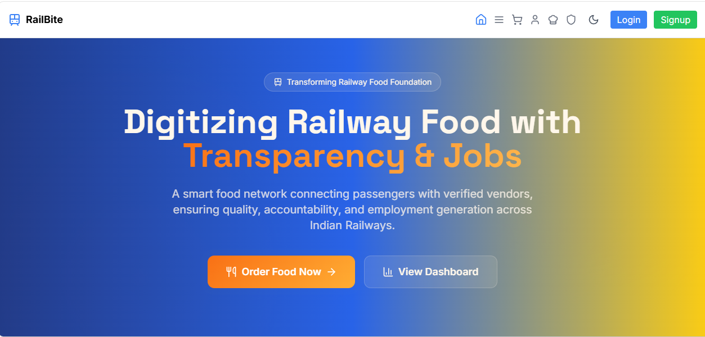
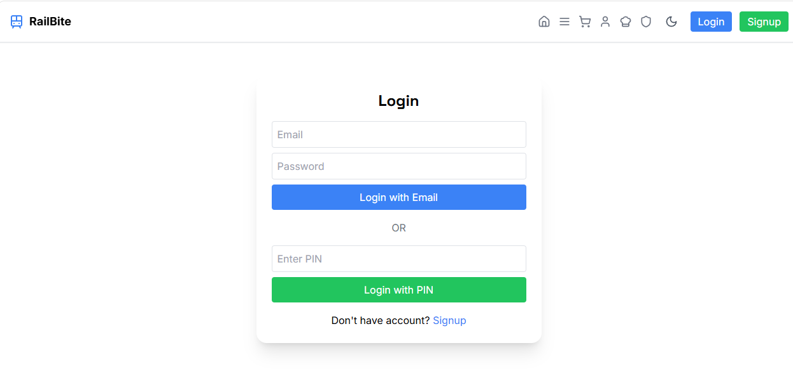
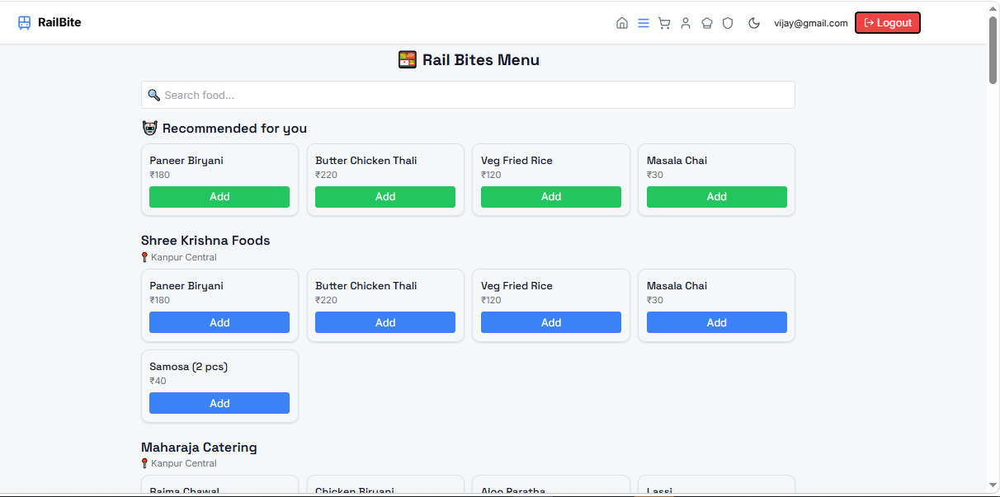
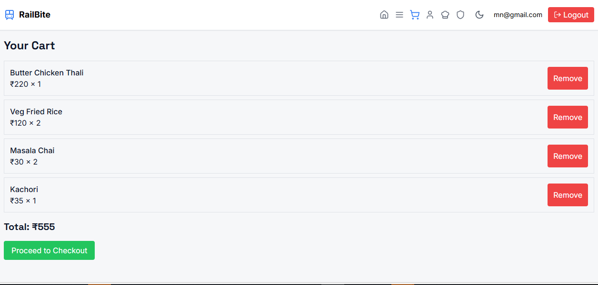
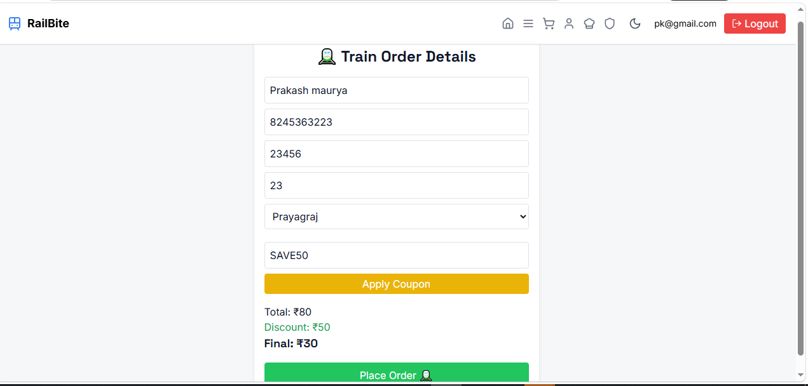

# 🚆 RailBite Bharat 🍽️

RailBite Bharat is a smart digital platform designed to modernize railway food ordering.  
Passengers can order food directly in trains using **PNR, seat number, and station selection**.

---

## 🌐 Live Website

 Vercel: https://rail-bits-bharat.vercel.app/  
 Netlify: https://rail-bits-bharat.netlify.app/

---

##  Project Overview

RailBite Bharat is a **fast, responsive, and user-friendly web application** built using modern frontend technologies.

It solves real-world problems in railway food delivery by enabling:
- 📦 Easy ordering inside trains  
- 🚆 PNR-based food delivery  
- 🪑 Seat-based delivery system  

---

## 🌟 Features

### 👤 User Features
- 🔐 Login / Signup (Firebase Auth)
- 🔢 PIN-based quick login
- 🍱 Browse food menu
- 🛒 Add to cart
- 🚆 Order using PNR, seat & station
- 📦 Order summary page

### 🎨 UI/UX Features
- ⚡ Fully responsive (mobile + desktop)
- 🌙 Dark mode support
- 🔔 Toast notifications
- ⏳ Loading spinners
- ✨ Smooth animations

### 🛠️ System Features
- 📊 Admin dashboard
- 📈 Revenue tracking
- ⚠️ Complaint monitoring
- 🏪 Vendor system

---

## 🖼️ Screenshot

> Add screenshot in `/screenshot` folder

### 🏠 Homepage


### 🔐 Login Page


### 🍱 Menu Page


### 🚆 Checkout Page


### 🚆  Order Details


---

## 🧑‍💻 Tech Stack

### Frontend
- ⚛️ React + Vite
- 🟦 TypeScript
- 🎨 Tailwind CSS
- 🧩 shadcn/ui
- 🔄 React Router

### Backend (Optional)
- 🟢 Node.js + Express

### Authentication
- 🔥 Firebase Auth

### Deployment
- ▲ Vercel
- 🌍 Netlify

---

## ⚙️ Installation & Setup

### 1️⃣ Clone the repository
```bash
git clone https://github.com/Prakash78-code/Rail-Bits-Bharat
cd cd Rail-Bits-Bharat